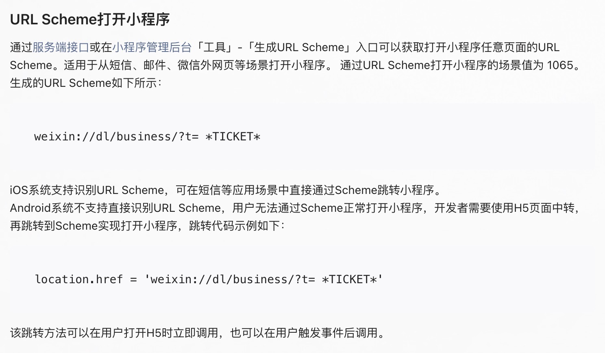

# 校庆地图落地跳转页

## 简介

百年校庆南大家园开屏落地页

纯 HTML，简明设计，动态背景，彰显艺术（草

所以为什么要有这个页面呢？

参考 [微信小程序官方文档关于 URL Scheme 的叙述](https://developers.weixin.qq.com/miniprogram/dev/framework/open-ability/url-scheme.html)

如果要使得 URL Scheme 在 iOS / Android 两端同时生效，则需要设置中转页面，就这么简单。

## 部署方式

本项目使用 Github Actions 进行部署，请直接在 Action Tab 中寻找并点击「Run Workflow」即可部署。

## 相关链接

[项目地址](http://xiaoqing.ncuos.com)
[CNZZ 站长统计](https://web.umeng.com/main.php?c=site&a=frame&siteid=1279872469#!/1619232653711/site/overview/1/1279872469/2021-04-24/2021-04-24)

## 预览图

